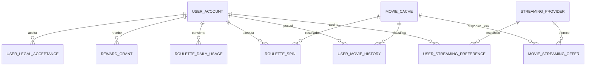

# Etapa 1 — modelagem de dados inicial

## Decisões de domínio

- Os IDs internos são UUIDs; `tmdb_id` é uma chave externa única, não a chave primária.
- O dia de uso da roleta respeita o fuso IANA do usuário, por exemplo `America/Sao_Paulo`.
- O plano define direitos, mas os giros não ficam como um contador mutável em `users`. Um registro diário evita condições de corrida e permite auditoria.
- `WATCHED` e `WATCHLIST` são estados mutuamente exclusivos nesta primeira versão. Ao marcar como assistido, o serviço remove o item da watchlist. Esta regra precisa de validação de produto antes das entidades JPA.
- A nota do usuário usa uma escala inteira de 1 a 5. A nota TMDB continua separada, na escala recebida da API.
- A disponibilidade de streaming é regional, tem validade curta e precisa guardar `country_code` e `last_synced_at`.

## Relacionamentos

## Tabelas propostas

### `user_account`

| Coluna | Tipo | Regra |
|---|---|---|
| `id` | UUID | PK |
| `email` | VARCHAR(254) | único e normalizado em minúsculas |
| `password_hash` | VARCHAR(255) | nunca exposto em DTO |
| `display_name` | VARCHAR(80) | obrigatório |
| `plan` | VARCHAR(20) | `FREE` ou `PREMIUM` |
| `premium_until` | TIMESTAMPTZ | nulo no plano free; direito efetivo não depende apenas do enum |
| `timezone` | VARCHAR(50) | fuso IANA usado na franquia diária |
| `country_code` | CHAR(2) | país ISO 3166-1 usado na disponibilidade de streaming |
| `email_verified_at` | TIMESTAMPTZ | nulo até a confirmação do e-mail |
| `onboarding_completed_at` | TIMESTAMPTZ | nulo enquanto incompleto |
| `deleted_at` | TIMESTAMPTZ | exclusão lógica durante o prazo de retenção definido |
| `created_at`, `updated_at` | TIMESTAMPTZ | auditoria |
| `version` | BIGINT | optimistic locking |

### `movie_cache`

| Coluna | Tipo | Regra |
|---|---|---|
| `id` | UUID | PK |
| `tmdb_id` | BIGINT | único |
| `title`, `original_title` | VARCHAR | metadados localizados |
| `overview` | TEXT | sinopse |
| `poster_path` | VARCHAR | guardar path, não URL completa |
| `release_date` | DATE | opcional |
| `vote_average` | NUMERIC(3,1) | nota TMDB |
| `vote_count` | INTEGER | evita recomendar filme com nota alta e poucos votos |
| `genre_ids` | INTEGER[] | suficiente para o MVP; normalizar se houver analytics complexo |
| `adult` | BOOLEAN | false por padrão no produto |
| `original_language` | VARCHAR(10) | filtro futuro |
| `runtime_minutes` | INTEGER | filtro futuro |
| `tmdb_last_synced_at` | TIMESTAMPTZ | controle de TTL |

### `user_movie_history`

| Coluna | Tipo | Regra |
|---|---|---|
| `id` | UUID | PK |
| `user_id` | UUID | FK para usuário |
| `movie_id` | UUID | FK para cache de filme |
| `status` | VARCHAR(20) | `WATCHED` ou `WATCHLIST` |
| `watched_at` | TIMESTAMPTZ | apenas para `WATCHED`; se omitido, backend usa o momento atual |
| `user_rating` | SMALLINT | opcional, de 1 a 5 |
| `created_at`, `updated_at` | TIMESTAMPTZ | auditoria |

Restrição única: `(user_id, movie_id)`. Índices adicionais: `(user_id, status, updated_at DESC)` e `(movie_id)`.

### `streaming_provider`

Catálogo com ID interno, `tmdb_provider_id`, nome, logo, prioridade de exibição e país. Não usar o nome do serviço como identificador.

### `user_streaming_preference`

Relação única `(user_id, provider_id)`, com `created_at`. O limite free de um provedor é validado no caso de uso, não por um constraint global do banco, porque o plano pode mudar.

### `movie_streaming_offer`

Relação entre filme e provedor com `country_code`, `monetization_type` (`FLATRATE`, `FREE`, `ADS`, `RENT`, `BUY`), URL de atribuição, `available_from`, `available_until` e `last_synced_at`. Restrição única pelo filme, provedor, país e tipo de monetização.

### `roulette_daily_usage`

Uma linha por `(user_id, usage_date)`, contendo `base_spins_used`, `rewarded_spins_granted`, `rewarded_spins_used`, `timezone_snapshot` e `version`. A atualização deve ser transacional/atômica.

### `roulette_spin`

Auditoria de cada tentativa: usuário, `idempotency_key`, filtros em JSONB, filme resultante, status (`PENDING`, `SUCCEEDED`, `NO_CANDIDATE`, `FAILED`) e timestamps. O giro só é consumido quando uma escolha válida é entregue; a regra deve ser confirmada.

### `reward_grant`

Registra a concessão de +3 giros com ID externo único, usuário, provedor de anúncio, quantidade e timestamp. É a proteção contra repetir a mesma recompensa por replay do cliente.

### `vibe`

Catálogo versionado e administrável com `slug`, rótulo, descrição e regras em JSONB (gêneros, keywords, faixa de nota, runtime e pesos). “Para rir” não deve ficar codificado em um `switch` Java: a equipe de produto precisará calibrar essas regras sem nova publicação do backend.

### `user_legal_acceptance`

Registro imutável de usuário, tipo e versão do documento, timestamp, país e evidência técnica estritamente necessária. O booleano do DTO apenas confirma a ação; o backend registra a versão vigente. Políticas de retenção, exportação e exclusão ainda precisam ser definidas.

## Regras que pertencem ao serviço, não aos DTOs

- Normalizar e verificar unicidade do e-mail.
- Validar `timezone` com `ZoneId.of(...)`.
- Aplicar hash de senha forte e nunca registrar a senha em logs.
- Buscar/criar `movie_cache` pelo `tmdbMovieId` recebido na borda.
- Remover `WATCHLIST` ao salvar `WATCHED`, caso a exclusividade seja aprovada.
- Impedir mais de um streaming no filtro do plano free.
- Consumir giro com idempotência e controle de concorrência.
